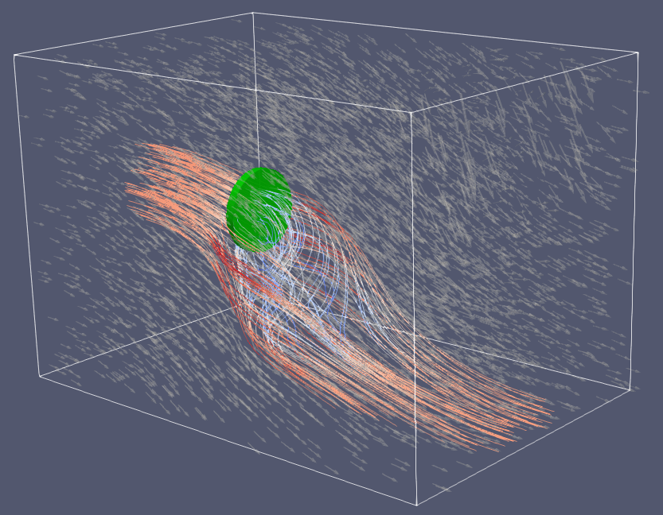

# IncompressibleNavierStokes

[](https://agdestein.github.io/IncompressibleNavierStokes.jl/stable)
[](https://agdestein.github.io/IncompressibleNavierStokes.jl/dev)
[](https://github.com/agdestein/IncompressibleNavierStokes.jl/actions)
[](https://codecov.io/gh/agdestein/IncompressibleNavierStokes.jl)
[](https://github.com/JuliaTesting/Aqua.jl)
[](https://doi.org/10.5281/zenodo.14217342)
[](https://juliapkgstats.com/pkg/IncompressibleNavierStokes)
[](https://juliapkgstats.com/pkg/IncompressibleNavierStokes)

This package implements energy-conserving solvers for the incompressible Navier-Stokes
equations on a staggered Cartesian grid. It is based on the Matlab package
[INS2D](https://github.com/bsanderse/INS2D)/[INS3D](https://github.com/bsanderse/INS3D). The simulations can be run on the single/multithreaded CPUs or Nvidia GPUs.

This package also provides experimental support for neural closure models for
large eddy simulation.

## Installation

To install IncompressibleNavierStokes, open up a Julia-REPL, type `]` to get
into Pkg-mode, and type:

```julia-repl
(v1.10) pkg> add IncompressibleNavierStokes
```

which will install the package and all dependencies to your local environment.
Note that IncompressibleNavierStokes requires Julia version `1.9` or above.

See the
[Documentation](https://agdestein.github.io/IncompressibleNavierStokes.jl/dev/generated/LidDrivenCavity2D/)
for examples of some typical workflows. More examples can be found in the
[`examples`](examples) directory.

## Source code for paper

See [this repository](https://github.com/agdestein/DivergenceConsistency) for the source code used in the paper
[Discretize first, filter next: learning divergence-consistent closure models for large-eddy simulation](https://www.sciencedirect.com/science/article/pii/S0021999124008258).

## Gallery

The velocity and pressure fields may be visualized in a live session using
[Makie](https://github.com/JuliaPlots/Makie.jl). Alternatively,
[ParaView](https://www.paraview.org/) may be used, after exporting individual
snapshot files using the `save_vtk` function, or the full time series using the
`VTKWriter` processor.

<table>
    <tbody>
        <tr>
            <td style="width: 25%;"></td>
            <td style="width: 25%;"></td>
            <td style="width: 25%;"></td>
            <td style="width: 25%;"></td>
        </tr>
        <tr>
            <td align="center"><a href="examples/Actuator2D.jl">Actuator (2D)</a></td>
            <td align="center"><a href="examples/BackwardFacingStep2D.jl">Backward facing step (2D)</a></td>
            <td align="center"><a href="examples/DecayingTurbulence2D.jl">Decaying turbulence (2D)</a></td>
            <td align="center"><a href="examples/TaylorGreenVortex2D.jl">Taylor-Green vortex (2D)</a></td>
        </tr>
        <tr>
            <td style="width: 25%;"></td>
            <td style="width: 25%;"></td>
            <td style="width: 25%;"></td>
            <td style="width: 25%;"></td>
        </tr>
        <tr>
            <td align="center"><a href="examples/Actuator3D.jl">Actuator (3D)</a></td>
            <td align="center"><a href="examples/BackwardFacingStep3D.jl">Backward facing step (3D)</a></td>
            <td align="center"><a href="examples/DecayingTurbulence3D.jl">Decaying turbulence (3D)</a></td>
            <td align="center"><a href="examples/TaylorGreenVortex3D.jl"> Taylor-Green vortex (3D)</a></td>
        </tr>
        <tr>
            <td style="width: 25%;"></td>
            <td style="width: 25%;"></td>
            <td style="width: 25%;"></td>
            <td style="width: 25%;">
              <!--  -->
            </td>
        </tr>
        <tr>
            <td align="center"><a href="examples/RayleighBenard2D.jl">Rayleigh-Bénard (2D)</a></td>
            <td align="center"><a href="examples/RayleighBenard3D.jl">Rayleigh-Bénard (3D)</a></td>
            <td align="center"><a href="examples/RayleighTaylor2D.jl">Rayleigh-Taylor (2D)</a></td>
            <!-- <td align="center"><a href="examples/RayleighTaylor3D.jl">Rayleigh-Taylor (3D)</a></td> -->
        </tr>
    </tbody>
</table>

## Demo

Make sure to have the `GLMakie` and `IncompressibleNavierStokes` installed:

```julia
using Pkg
Pkg.add(["GLMakie", "IncompressibleNavierStokes"])
```

Then run run the following code to make a short animation:

```julia
using GLMakie
using IncompressibleNavierStokes

# Setup
setup = Setup(
    x = (tanh_grid(0.0, 2.0, 200, 1.2), tanh_grid(0.0, 1.0, 100, 1.2)),
    boundary_conditions = ((DirichletBC(), DirichletBC()), (DirichletBC(), DirichletBC())),
    temperature = temperature_equation(;
        Pr = 0.71,
        Ra = 1e7,
        Ge = 1.0,
        boundary_conditions = (
            (SymmetricBC(), SymmetricBC()),
            (DirichletBC(1.0), DirichletBC(0.0)),
        ),
    ),
)

# Solve equation
solve_unsteady(;
    setup,
    ustart = velocityfield(setup, (dim, x, y) -> zero(x)),
    tempstart = temperaturefield(setup, (x, y) -> 1 / 2 + sinpi(30 * x) / 100),
    tlims = (0.0, 30.0),
    Δt = 0.02,
    processors = (;
        anim = animator(;
            setup,
            path = "temperature.mp4",
            fieldname = :temperature,
            colorrange = (0.0, 1.0),
            size = (900, 500),
            colormap = :seaborn_icefire_gradient,
            nupdate = 5,
        ),
    ),
)
```

## Similar projects

- [WaterLily.jl](https://github.com/weymouth/WaterLily.jl/)
  Incompressible solver with immersed boundaries
- [Oceananigans.jl](https://github.com/CliMA/Oceananigans.jl):
  Ocean simulations
- [ClimaCore.jl](https://github.com/CliMA/ClimaCore.jl):
  Atmospheric simulations
- [Trixi.jl](https://github.com/trixi-framework/Trixi.jl):
  High order solvers for various hyperbolic equations
- [Ferrite.jl](https://github.com/Ferrite-FEM/Ferrite.jl):
  Finite element discretizations
- [Gridap.jl](https://github.com/gridap/Gridap.jl):
  Finite element discretizations
- [FourierFlows.jl](https://github.com/FourierFlows/FourierFlows.jl):
  Pseudo-spectral discretizations
