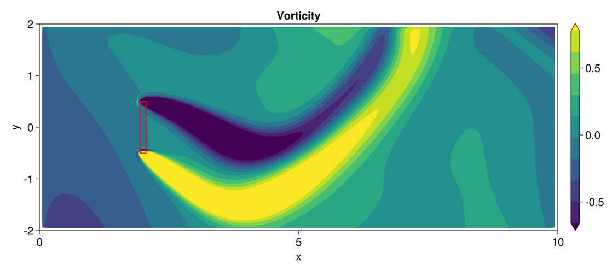
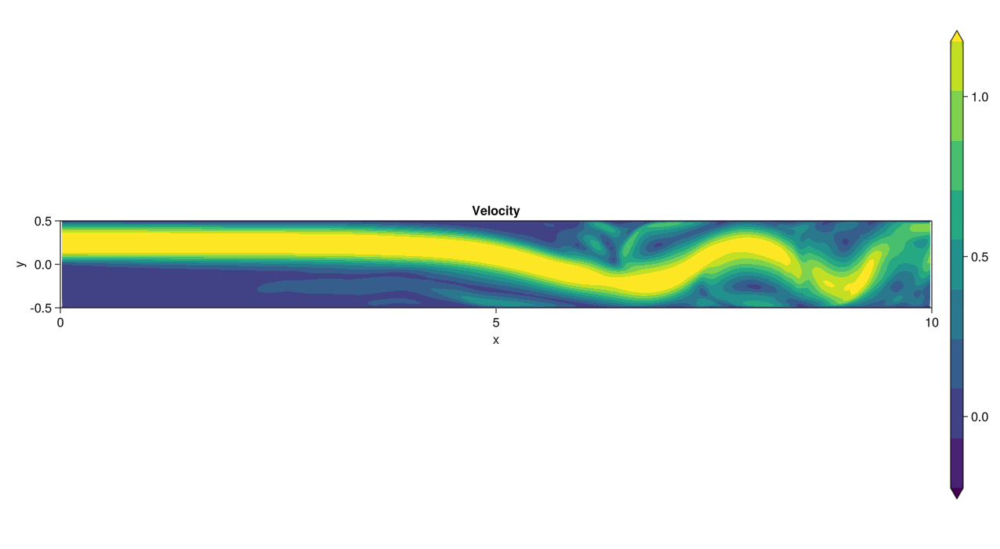
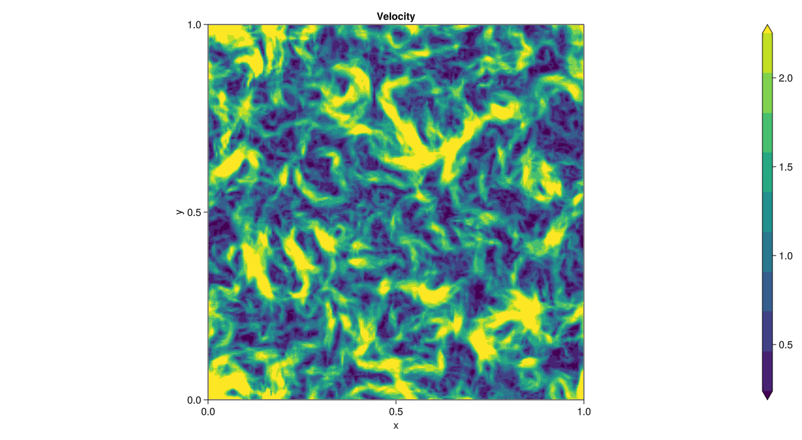
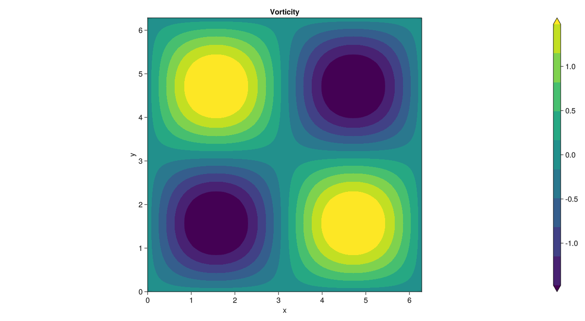
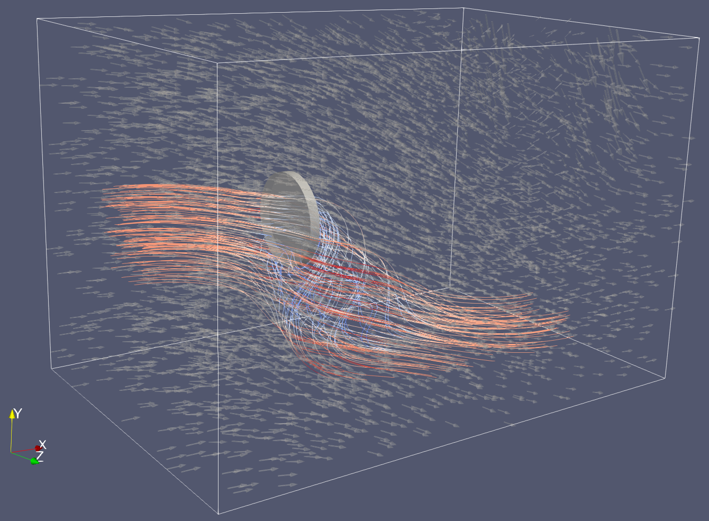
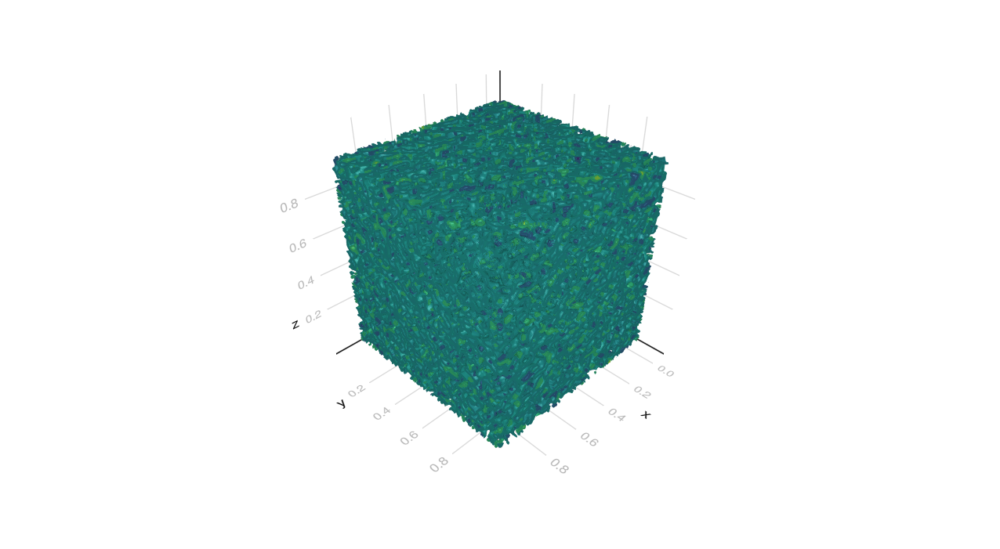

# IncompressibleNavierStokes

| Documentation | Workflows | Code coverage | Quality assurance |
| :-----------: | :-------: | :-----------: | :---------------: |
| [](https://agdestein.github.io/IncompressibleNavierStokes.jl/stable) [](https://agdestein.github.io/IncompressibleNavierStokes.jl/dev) | [](https://github.com/agdestein/IncompressibleNavierStokes.jl/actions) | [](https://codecov.io/gh/agdestein/IncompressibleNavierStokes.jl) | [](https://github.com/JuliaTesting/Aqua.jl) |

This package implements energy-conserving solvers for the incompressible Navier-Stokes
equations on a staggered Cartesian grid. It is based on the Matlab package
[INS2D](https://github.com/bsanderse/INS2D)/[INS3D](https://github.com/bsanderse/INS3D).


## Installation

To install IncompressibleNavierStokes, open up a Julia-REPL, type `]` to get
into Pkg-mode, and type:

```
add IncompressibleNavierStokes
```

which will install the package and all dependencies to your local environment.
Note that IncompressibleNavierStokes requires Julia version `1.7` or above.

See the
[Documentation](https://agdestein.github.io/IncompressibleNavierStokes.jl/dev/generated/LidDrivenCavity2D/)
for examples of some typical workflows. More examples can be found in the
[`examples`](examples) directory.

## Gallery

The velocity and pressure fields may be visualized in a live session using
[Makie](https://github.com/JuliaPlots/Makie.jl). Alternatively,
[ParaView](https://www.paraview.org/) may be used, after exporting individual
snapshot files using the `save_vtk` function, or the full time series using the
`VTKWriter` processor.

|      |                  |                 |                 |
|:---------------------------------------:|:-------------------------------------------------------------:|:------------------------------------------------------------:|:-----------------------------------------------------------:|
| [Actuator (2D)](examples/Actuator2D.jl) | [Backward Facing Step (2D)](examples/BackwardFacingStep2D.jl) | [Decaying Turbulence (2D)](examples/DecayingTurbulence2D.jl) | [Taylor-Green Vortex (2D)](examples/TaylorGreenVortex2D.jl) |
|      |                  |                 |                 |
| [Actuator (3D)](examples/Actuator3D.jl) | [Backward Facing Step (3D)](examples/BackwardFacingStep3D.jl) | [Decaying Turbulence (3D)](examples/DecayingTurbulence3D.jl) | [Taylor-Green Vortex (3D)](examples/TaylorGreenVortex3D.jl) |


## Demo

The following example code  using a negative body force on a small rectangle
with an unsteady inflow. It simulates a wind turbine (actuator) under varying
wind conditions.

```julia
using GLMakie
using IncompressibleNavierStokes

# Viscosity model
viscosity_model = LaminarModel(; Re = 100.0)

# Boundary conditions: Unsteady BC requires time derivatives
u_bc(x, y, t) = x ≈ 0.0 ? cos(π / 6 * sin(π / 6 * t)) : 0.0
v_bc(x, y, t) = x ≈ 0.0 ? sin(π / 6 * sin(π / 6 * t)) : 0.0
dudt_bc(x, y, t) = x ≈ 0.0 ? -(π / 6)^2 * cos(π / 6 * t) * sin(π / 6 * sin(π / 6 * t)) : 0.0
dvdt_bc(x, y, t) = x ≈ 0.0 ? (π / 6)^2 * cos(π / 6 * t) * cos(π / 6 * sin(π / 6 * t)) : 0.0
bc_type = (;
    u = (; x = (:dirichlet, :pressure), y = (:symmetric, :symmetric)),
    v = (; x = (:dirichlet, :symmetric), y = (:pressure, :pressure)),
)

# A 2D grid is a Cartesian product of two vectors
x = LinRange(0.0, 10.0, 200)
y = LinRange(-2.0, 2.0, 80)

# Actuator body force: A thrust coefficient `Cₜ` distributed over a thin rectangle
xc, yc = 2.0, 0.0 # Disk center
D = 1.0           # Disk diameter
δ = 0.11          # Disk thickness
Cₜ = 5e-4         # Thrust coefficient
cₜ = Cₜ / (D * δ)
inside(x, y) = abs(x - xc) ≤ δ / 2 && abs(y - yc) ≤ D / 2
bodyforce_u(x, y) = -cₜ * inside(x, y)
bodyforce_v(x, y) = 0.0

# Build setup and assemble operators
setup = Setup(
    x,
    y;
    viscosity_model,
    u_bc,
    v_bc,
    dudt_bc,
    dvdt_bc,
    bc_type,
    bodyforce_u,
    bodyforce_v,
);

# Time interval
t_start, t_end = tlims = (0.0, 40.0)

# Initial conditions (extend inflow)
initial_velocity_u(x, y) = 1.0
initial_velocity_v(x, y) = 0.0
initial_pressure(x, y) = 0.0
V₀, p₀ = create_initial_conditions(
    setup,
    initial_velocity_u,
    initial_velocity_v,
    t_start;
    initial_pressure,
);

# Time step processors
processors = (
    # Record solution every fourth time step
    animator(setup, "vorticity.mp4"; nupdate = 4),

    # Log time step information
    step_logger(),
)

# Solve unsteady Navier-Stokes equations
V, p, outputs = solve_unsteady(
    setup, V₀, p₀, tlims;
    method = RK44P2(),
    Δt = 0.05,
    processors,
)
```

The resulting animation is shown below.

https://github.com/agdestein/IncompressibleNavierStokes.jl/assets/40632532/6ee09a03-1674-46e0-843c-000f0b9b9527
