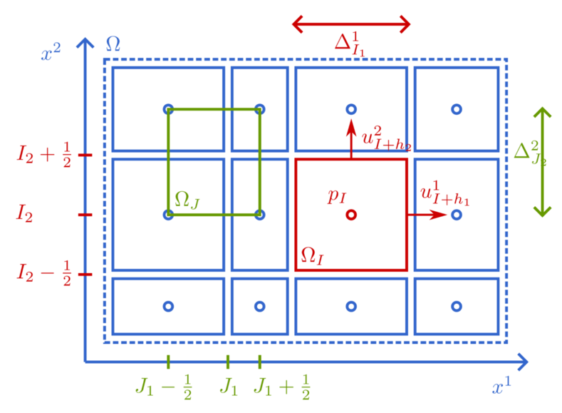

```@meta
CurrentModule = IncompressibleNavierStokes
```

# Spatial and temporal discretization

This page describes the discretization used in the solver, in the same
notation as the code. The domain is discretized on a staggered Cartesian
grid as proposed by Harlow and Welch [Harlow1965](@cite), and the equations
are stepped in time with explicit Runge-Kutta methods [Sanderse2012](@cite).

## Staggered grid

The rectangular domain ``\Omega = \prod_{\alpha = 1}^d [a_\alpha, b_\alpha]``
is partitioned into finite volumes

```math
\Omega_I = \prod_{\alpha = 1}^d
\left[ x^\alpha_{I_\alpha - 1}, x^\alpha_{I_\alpha} \right],
```

indexed by the Cartesian index ``I = (I_1, \dots, I_d)``. The Cartesian index
lets us write dimension-agnostic expressions such as ``u_I`` instead of
``u_{i j}`` in 2D or ``u_{i j k}`` in 3D, and the code uses the same
convention (`u[I]` instead of `u[i, j]` or `u[i, j, k]`). The ``\alpha``-th
unit vector is denoted ``e_\alpha``, e.g. ``I + e_2 = (I_1, I_2 + 1, I_3)``
in 3D. The grid is defined by the volume boundary coordinates ``x^\alpha_i``
passed to [`Setup`](@ref) (the vectors `x[α]`), from which the volume widths
``\Delta^\alpha_i = x^\alpha_i - x^\alpha_{i - 1}`` (the vectors `Δ[α]`)
follow. The grid does not need to be uniform.

The unknowns are staggered:

- The pressure ``p_I`` is defined in the volume *center*.
- The velocity component ``u^\alpha_I`` is defined on the *right face* of
  volume ``I`` in direction ``\alpha``, i.e. on the boundary between
  ``\Omega_I`` and ``\Omega_{I + e_\alpha}``. In the code, all components are
  stored in one array with the component as the last index: `u[I, α]`.



In addition to the interior volumes, all fields carry one layer of *ghost
volumes* on each boundary. The ghost values are filled by
[`apply_bc_u!`](@ref) and [`apply_bc_p!`](@ref) such that the interior
finite-volume stencils automatically account for the boundary conditions
(Dirichlet, periodic, symmetric, or pressure). This is why the field arrays
have size `N` while the degrees of freedom are indexed by `Ip` and `Iu`.

## Mass equation

Integrating the mass equation over the pressure volume ``\Omega_I`` and
approximating the face integrals with the mid-point rule gives the discrete
divergence-free constraint

```math
\sum_{\alpha = 1}^d
\frac{u^\alpha_I - u^\alpha_{I - e_\alpha}}{\Delta^\alpha_{I_\alpha}} = 0,
```

a backward difference of the face velocities surrounding the pressure volume.
This is the [`divergence`](@ref) operator. Since we divided by the volume
size, the discrete equation resembles the continuous one ``\nabla \cdot u =
0``.

## Momentum equations

The momentum equation for ``u^\alpha`` is integrated over the shifted volume
centered on the ``\alpha``-face. Approximating the face integrals with the
mid-point rule and the diffusive fluxes with central differences gives

```math
\frac{\mathrm{d}}{\mathrm{d} t} u^\alpha_I =
- \sum_{\beta = 1}^d (\delta_\beta (u^\alpha u^\beta))_I
+ \nu \sum_{\beta = 1}^d (\delta_\beta \delta_\beta u^\alpha)_I
+ f^\alpha_I
- (\delta_\alpha p)_I,
```

where ``\delta_\beta`` denotes the central difference in direction ``\beta``
at the position in question. The pressure gradient is a forward difference of
the two pressure values adjacent to the ``\alpha``-face
([`pressuregradient`](@ref)). In the convective term, the two velocity
components in the product ``u^\alpha u^\beta`` are not stored at the
required position; they are obtained by averaging with weights ``1/2`` for
the ``\alpha``-component and linear interpolation for the
``\beta``-component. This particular choice preserves the skew-symmetry of
the convection operator on uniform grids, such that convection neither
creates nor destroys kinetic energy [Verstappen2003](@cite). Convection and
diffusion are implemented together in the right-hand side force
[`navierstokes!`](@ref), with [`convection`](@ref) and [`diffusion`](@ref) as
separate differentiable operators.

All operators come in two variants: a fast mutating one
(e.g. [`divergence!`](@ref)) and a differentiable non-mutating one
(e.g. [`divergence`](@ref)). See [Operators](operators.md) and
[Differentiating code](differentiability.md).

## Discrete pressure Poisson equation

Instead of discretizing the continuous pressure Poisson equation, we require
that the *discrete* velocity field stays divergence free. Let ``M`` denote
the discrete divergence, ``G`` the discrete pressure gradient, ``W`` the
diagonal matrix of pressure volume sizes, and ``F(u)`` all discrete forces
except the pressure gradient. Applying ``M`` to the discrete momentum
equations and requiring ``\frac{\mathrm{d}}{\mathrm{d} t} M u = 0`` yields

```math
L p = W M F(u),
```

where ``L = W M G`` is a symmetric positive semi-definite discrete Laplacian.
This equation is solved by the pressure solvers ([`poisson`](@ref), see
[Pressure solvers](pressure.md)). Subtracting the resulting pressure gradient
projects a velocity field onto the space of discretely divergence-free
fields; this is the [`project`](@ref) operator. Without pressure boundary
conditions ``L`` has a zero eigenvalue and the pressure is determined up to a
constant, which we set to zero.

Sparse matrix representations of ``M``, ``G``, ``L``, ``W``, and the
boundary condition kernels are available, see [Sparse
matrices](matrices.md).

## Time discretization

The spatially discretized system is a differential-algebraic system: an ODE
for the velocity subject to the algebraic divergence-free constraint. It is
stepped in time with explicit Runge-Kutta methods, where each stage velocity
is made divergence free by a pressure projection. This retains the accuracy
of the underlying Runge-Kutta method for the velocity; see Sanderse and Koren
[Sanderse2012](@cite) for an analysis.

Given the state ``u^n`` at time ``t^n``, a stage ``i`` of an explicit method
with tableau ``(A, b, c)`` computes

```math
u_i = \Pi \left( u^n + \Delta t \sum_{j < i} a_{i j} F(u_j, t_j) \right),
```

where ``\Pi`` is the pressure projection, and the next step ``u^{n + 1}``
follows analogously with weights ``b_j``. The default method is
[`LMWray3`](@ref), a low-storage third-order method of Wray
[Wray1990](@cite) that only needs three vector fields of storage. A large
collection of tableaus is available in [`RKMethods`](@ref).

The time step can be fixed (`Δt`) or chosen adaptively from a CFL condition
based on the convective and diffusive stability limits (`Δt = nothing` in
[`solve_unsteady`](@ref), the default).
