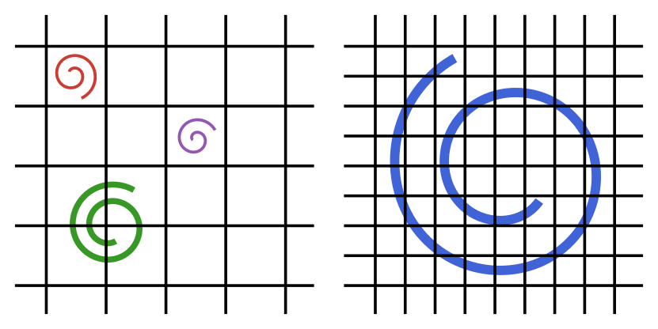

```@meta
CurrentModule = IncompressibleNavierStokes
```

# Large eddy simulation

Depending on the problem specification, a given grid resolution may not be
sufficient to resolve all spatial features of the flow. Consider the following
example:



On the left, the grid spacing is too large to capture the smallest eddies in
the flow. These eddies create sub-grid stresses that also affect the large
scale features. The grid must be refined if we want to compute these stresses
exactly.

On the right, the smallest spatial feature of the flow is fully resolved, and
there are no sub-grid stresses. The equations can be solved without worrying
about errors from unresolved features. This is known as *Direct Numerical
Simulation* (DNS).

If refining the grid is too costly, a closure model can be used to predict the
sub-grid stresses. The models only give an estimate for these stresses, and may
need to be calibrated to the given problem. When used correctly, they can
predict the evolution of the large fluid motions without computing the sub-grid
motions themselves. This is known as *Large Eddy Simulation* (LES).

## Eddy viscosity models

Eddy viscosity models add a local contribution to the global baseline
viscosity. The baseline viscosity models transfer of energy from resolved to
atomic scales. The new turbulent viscosity on the other hand, models energy
transfer from resolved to unresolved scales. This non-constant field is
computed from the local velocity field.

The following eddy viscosity models are implemented (see Silvis et al.
[Silvis2017](@cite) for an overview and analysis):

- `Smagorinsky` [Smagorinsky1963](@cite) (2D and 3D)
- `WALE` (wall-adapting local eddy-viscosity) [Nicoud1999](@cite) (3D)
- `Vreman` [Vreman2004](@cite) (3D)
- `QR` [Verstappen2011](@cite) (3D)

The models are used by including them in the right-hand side function passed
to [`solve_unsteady`](@ref), with the model coefficient in `params`; see
`examples/ChannelFlow.jl` for a complete simulation with an eddy viscosity
model. Neural closure models trained on the discrete equations of this
package are explored in Agdestein and Sanderse [Agdestein2025](@cite).

## API

```@autodocs
Modules = [IncompressibleNavierStokes]
Pages = ["eddyviscosity.jl"]
```
